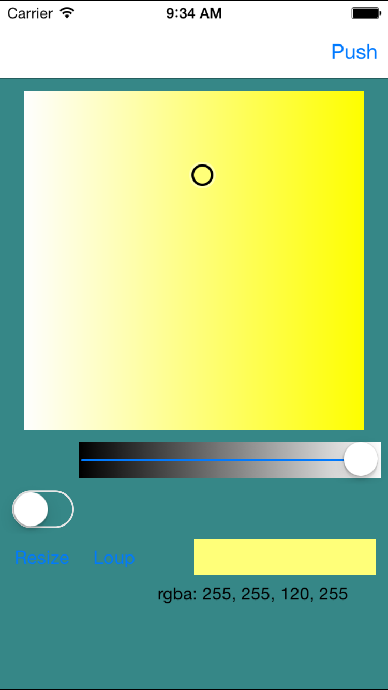
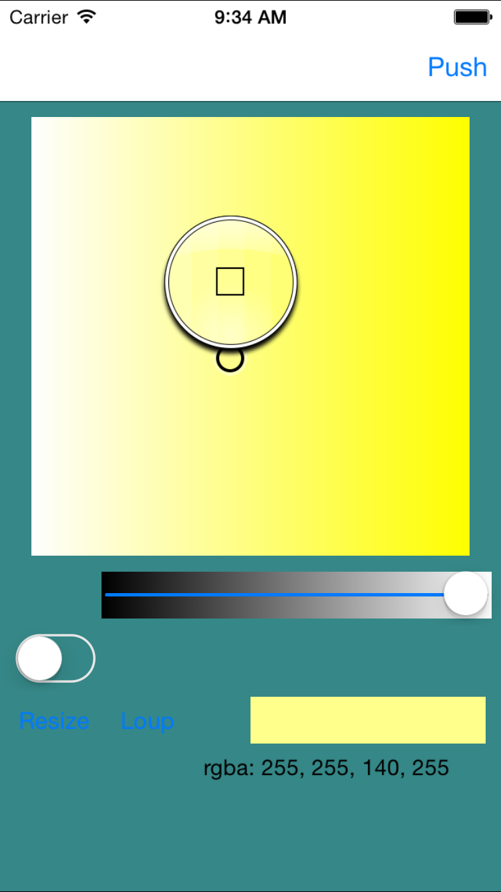
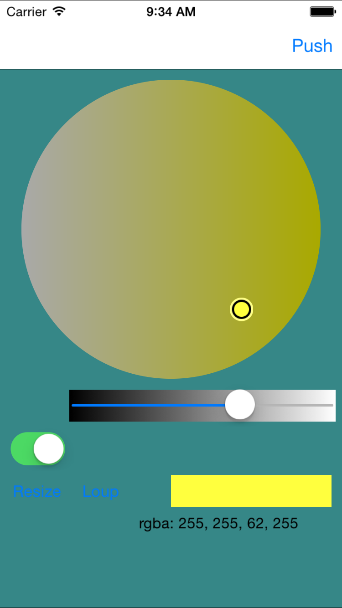
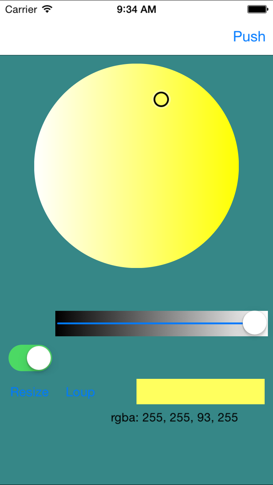

# Project:

iOS color temperature picker that is resolution independent.

Based on [RSColorPicker](https://github.com/RSully/RSColorPicker).
Inspired by [ANColorPicker](https://github.com/unixpickle/ANColorPicker).
Also uses [ANImageBitmapRep](https://github.com/unixpickle/ANImageBitmapRep) for easy pixel-level manipulation.

And of course, thanks to [Wikipedia](http://en.wikipedia.org/wiki/HSL_and_HSV).

## Class Files:

### `QPColorTemperaturePickerView`

Square (circle) color-temperature-picker that handles touch events, allows for brightness control. Uses delegation to report color selection as-changed

## Usage:

See included example project (`TestColorViewController`).

### Requirements:

* Accelerate.framework
* QuartzCore.framework
* CoreGraphics.framework
* UIKit.framework
* Foundation.framework
* QPImageBitmapRep (included, modified from ANImageBitmapRep)

## License

See [LICENSE.md](LICENSE.md). You know the drill, use at your own risk, this code is given without support, etc. And for good karma link back to this github.com page, [github.com/edwardtoday/qpcolortemperaturepicker](https://github.com/edwardtoday/QPColorTemperaturePicker)

***

## Contributing

Pull requests are welcome for bug fixes or feature additions. If you contribute code, make sure you stick to the [contibution guidelines](CONTRIBUTING.md).
